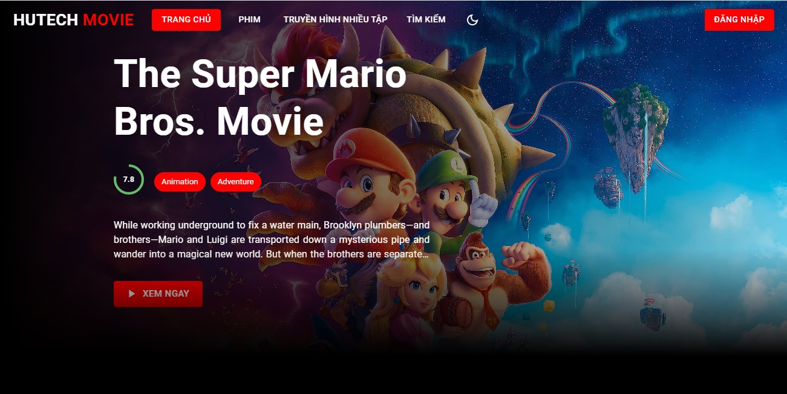

# MERN-STACK-MOVIE-PROJECT-2023

#### 
#### Giới thiệu
Là một trang web cung cấp các bài đánh giá và nhận xét về các bộ phim. Trang web này cung cấp cho người dùng thông tin chi tiết về nội dung, diễn viên, đạo diễn và các yếu tố khác của một bộ phim, giúp cho người dùng có thể đưa ra quyết định xem hoặc không xem một bộ phim nào đó. Ngoài ra web review phim cũng thường cập nhật các bài viết mới nhất về các bộ phim đang hot và đưa ra các bảng xếp hạng về các bộ phim đáng xem.

#### [The Movie Database (TMDB)](https://www.themoviedb.org/documentation/api)
API The Movie Database (TMDB) là một dịch vụ web cung cấp thông tin về phim và chương trình truyền hình, cung cấp cho các nhà phát triển và các ứng dụng truyền thông truy cập vào cơ sở dữ liệu của TMDB, bao gồm các thông tin về phim, diễn viên, đạo diễn, nội dung và các đánh giá của người dùng. 

## Tính năng
- Đăng ký, đăng nhập
- Xem review
- Tìm kiếm 
- Bình luận, đánh giá

## Sử dụng
- [Create React App](https://create-react-app.dev/): là một công cụ dùng để tạo một ứng dụng React mới một cách nhanh chóng và đơn giản. Nó cung cấp các cấu hình mặc định và các tiện ích để phát triển ứng dụng React một cách hiệu quả.
- [Material UI](https://mui.com/): là một thư viện giao diện người dùng cho React, nó cung cấp một bộ các thành phần UI được thiết kế theo phong cách Material Design của Google, giúp tăng tốc độ phát triển và cải thiện trải nghiệm người dùng.
- [Mongoose](https://mongoosejs.com/): là một thư viện JavaScript cho phép tương tác với MongoDB thông qua các mô hình đối tượng (Object Document Mapper), giúp đơn giản hóa việc lưu trữ, tìm kiếm và truy xuất dữ liệu từ cơ sở dữ liệu MongoDB.
- [Express](https://expressjs.com/): là một framework JavaScript cho phép phát triển các ứng dụng web và API một cách nhanh chóng và dễ dàng, nó cung cấp các tính năng như routing, middleware, và phân tích các yêu cầu HTTP.
- [Express Validator](https://express-validator.github.io/docs/): là một thư viện validator middleware cho ExpressJS, giúp xác thực dữ liệu đầu vào của người dùng, giúp đảm bảo tính toàn vẹn dữ liệu và tăng cường bảo mật cho ứng dụng.
- [React Router](https://reactrouter.com/en/main): là một thư viện JavaScript cho phép điều hướng trang cho ứng dụng React, giúp phát triển ứng dụng có tính tương tác cao và cải thiện trải nghiệm người dùng.
- [Formik](https://formik.org/): là một thư viện React cho phép quản lý và xử lý các biểu mẫu (form), giúp đơn giản hóa việc xử lý dữ liệu đầu vào của người dùng và tăng cường tính tương tác của ứng dụng.
- [Yup](https://github.com/jquense/yup):  là một thư viện JavaScript cho phép xác thực dữ liệu đầu vào, giúp đảm bảo tính toàn vẹn dữ liệu và tăng cường bảo mật cho ứng dụng.
- [Axios](https://axios-http.com/):  là một thư viện JavaScript cho phép tương tác với các API, giúp lấy và gửi dữ liệu giữa ứng dụng và server, tăng cường tính tương tác của ứng dụng.
- [ThemovieDB](https://www.themoviedb.org/): The Movie Database (TMDB) là một trang web chứa thông tin về phim ảnh, bao gồm thông tin về các bộ phim, diễn viên, đạo diễn và cả những tin tức mới nhất về ngành công nghiệp điện ảnh. TMDB cung cấp một API cho phép lấy thông tin về phim, đạo diễn, diễn viên, đánh giá, hình ảnh, trailer và nhiều hơn nữa.
- [Swiper](https://swiperjs.com/): là một thư viện JavaScript cho phép tạo ra các slideshow và carousel trên trang web, giúp cải thiện trải nghiệm người dùng và tăng tính tương tác của ứng dụng.
- [JWT](https://create-react-app.dev/): JSON Web Token (JWT) là một chuẩn định dạng token được sử dụng để xác thực và phân quyền trong các ứng dụng web. JWT bao gồm ba phần: header, payload và signature, được mã hóa theo chuẩn Base64. JWT có thể được sử dụng để bảo mật các API, cung cấp chức năng đăng nhập và đăng ký cho người dùng, và hỗ trợ việc chuyển đổi giữa các dịch vụ khác nhau một cách dễ dàng và an toàn.

### Cài đặt thư viện:
```
yarn add axios cookie-parser cors dotenv express express-validator jsonwebtoken mongoose nodemon 
```

#### Front end
    +) Create react app
    +) Material UI
    +) SwiperJS
    +) React router v6
    +) Formik
    +) Yup
    +) Axios
#### Back end
    +)  Express rest api
    +)  Express validator 
    +)  Jsonwebtoken
    +)  Mongoose
    +)  Axios

## Hướng dẫn khởi chạy dự án
1. CLone: Open terminal
```
git clone https://github.com/anhtuana2k422001/mern_project_movie.git
```
2. Chạy server
```
cd server 
yarn install
yarn start
```

3. Chạy client
```
cd client
yarn install
yarn start
```

#####  Thời gian bắt đầu:
 24 - 02 - 2023

#####  Thành viên:
-  Hồ Anh Tuấn
-  Võ Anh Quân
-  Phan Thị Kim Thoa

#####  Đóng góp:
[Nội dung chi tiết](https://docs.google.com/spreadsheets/d/1Bh1sdT33DRKXHPGdVZTFN59q1yU4Wc5XyV9aEGt0ftY/edit?fbclid=IwAR14zWtqOE4Ylg02_x9Rjm4Pu2S9Lf0MRKisEZf6YvrBSECG5_PT1WamjH4#gid=0)

#####  Nguồn tham khảo:
[Part 1 | Full Mern Stack ](https://www.youtube.com/watch?v=j-Sn1b4OlLA)

[Part 2 | Full Mern Stack ](https://www.youtube.com/watch?v=Q_uLi4f27Lc)
